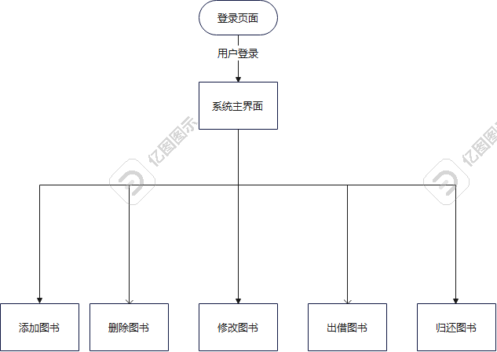

## 应用案例

### 需求分析
基于django开发一个图书管理系统,功能需求如下



### 数据表结构
用户表,基于django的用户模型
书籍表(books)

| 字段名    | 类型   | 说明       |
|--------|------|----------|
| id     | str  | 图书编号(唯一) |
| name   | str  | 书箱名      |
| statua | bool | 是否出借     |

借还记录表(Record)

| 字段名    | 类型       | 说明                     |
|--------|----------|------------------------|
| id     | int      | 主键                     |
| book   | int      | 书籍ID                   |
| sdate  | datetime | 借书时间                   |
| sname  | str      | 借书人                    |
| e_date | datetime | 还书时间(默认为空,归还后才更新为归还时间) |

### 创建应用books
```bash
python manage.py startapp booksmanage
```

### 修改数据库配置
```python
DATABASES = {
    # 'default': {
    #     'ENGINE': 'django.db.backends.sqlite3',
    #     'NAME': BASE_DIR / 'db.sqlite3',
    # },
    'default': {
        # Django项目中使用的数据库引擎,需要修改为mysql
        'ENGINE': 'django.db.backends.mysql',
        # 数据库的库名
        'NAME': 'booksmanage',
        # 账号密码主机端口
        'USER': 'root',
        'PASSWORD': 'root',
        'HOST': '127.0.0.1',
        'PORT': 3306,
        # 数据库默认字符集
        'OPTIONS': {
            'charset': 'utf8',
        }
    }
}
```

### 设置admin语言
```python
# 设置语言为中文
LANGUAGE_CODE = 'zh-hans'
# 设置时区为上海
TIME_ZONE = 'Asia/Shanghai'
```

### 关闭csrftoken检查
```python
MIDDLEWARE = [
    'django.middleware.security.SecurityMiddleware',
    'django.contrib.sessions.middleware.SessionMiddleware',
    'django.middleware.common.CommonMiddleware',
    # 'django.middleware.csrf.CsrfViewMiddleware',
    'django.contrib.auth.middleware.AuthenticationMiddleware',
    'django.contrib.messages.middleware.MessageMiddleware',
    'django.middleware.clickjacking.XFrameOptionsMiddleware',
]
```
### 引入booksmanage应用
settings.py
```python
INSTALLED_APPS = [
    'django.contrib.auth',
    'django.contrib.admin',
    'django.contrib.contenttypes',
    'django.contrib.sessions',
    'django.contrib.messages',
    'django.contrib.staticfiles',
    'news',
    'books',
    'booksmanage',
]
```


## 模型类设计

### 定义模型类
> 可以采用django自带的用户系统,用户模型可以定义,只需要定义图书,和图书出借记录模型

booksmanage/models.py
```python
from datetime import datetime

from django.db import models


# Create your models here.

class Books(models.Model):
    id = models.CharField(max_length=20, primary_key=True, verbose_name="图书编号")
    name = models.CharField(max_length=50, verbose_name="书名")
    status = models.BooleanField(default=False, verbose_name="是否出借")

    class Meta:
        db_table = 'books'
        verbose_name = "图书表"
        verbose_name_plural = verbose_name

    def __str__(self):
        return self.name


class Record(models.Model):
    book = models.ForeignKey('Books', on_delete=models.CASCADE, verbose_name="书籍")
    name = models.CharField(max_length=20, verbose_name="出借人")
    # 设置auto_created:数据创建时自动设置为当前时间
    # auto_now=True:当数据任何一个字段发生修改,都自动更新时间
    s_date = models.DateTimeField(verbose_name="出借时间", auto_now_add=True, auto_created=True)
    e_date = models.DateTimeField(verbose_name="归还时间", auto_now=True, auto_created=True)
    state = models.BooleanField(default=False, verbose_name="是否归还")

    class Meta:
        db_table = 'record'
        verbose_name = "借还记录表"
        verbose_name_plural = verbose_name

    def __str__(self):
        return self.name


```

### 应用数据模型

```bash

python manage.py makemigrations

python manage.py migrate
```

### 查看数据库

```bash
mysql -uroot -proot -D news -e "show create table books\G"
mysql -uroot -proot -D news -e "show create table Record\G"
```

### 注册到admin管理后台

booksmanage/admin.py
```python
from django.contrib import admin

from booksmanage.models import Books, Record


# 注册模型类
class BooksAdmin(admin.ModelAdmin):
    list_display = ['id', 'name', 'status']


# 注册模型类
class RecordAdmin(admin.ModelAdmin):
    list_display = ['id', 'name', 's_date', 'e_date', 'state', 'book']


# 注册到admin后台
admin.site.register(Books, BooksAdmin)
admin.site.register(Record, RecordAdmin)
```